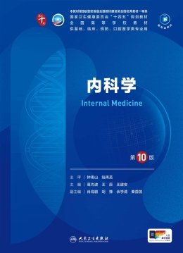

# Internal Medicine — Internal-Medicine-PMPH-10edition
<div align="center">

> *"A 21st Century Medical Student Guide"*

[](LICENSE)
[](https://claude.ai/code)
[](https://skills.sh)

<br>
> A clinical skills handbook based on People's Medical Publishing House *Internal Medicine*, 10th Edition — 423 core internal medicine clinical skills
<br>
<br>

<br>

Why torture yourself reading a whole textbook?<br>
Just ask a question, and get the solution straight from the textbook.

<br>

**Other Languages:**

[English](README_EN.md) · [日本語](README_JA.md) · [Français](README_FR.md) · [Русский](README_RU.md)

</div>

---

## About

This project systematically integrates core knowledge across internal medicine, covering cardiovascular diseases, respiratory diseases, digestive diseases, endocrine and metabolic diseases, renal diseases, hematologic diseases, rheumatologic and immunologic diseases, infectious diseases and tuberculosis, poisoning and physical/chemical injuries, oncology and comprehensive care, chronic disease management and stratified care, clinical skills and procedures, pharmacotherapy and safety, laboratory and imaging interpretation, and educational resources and quality control — **15 major categories**, totaling **423 key clinical skills**.

**Target Audience**: Internists, general practitioners, emergency physicians, medical students, residents in standardized training

**Reference Textbook**: People's Medical Publishing House *Internal Medicine*, 10th Edition

**⚠️ Risk ⚠️**: High-risk clinical treatments, procedures, and dosing guidance may not be suitable for general installation or unsupervised use.

**Mitigation**: Intended for qualified clinicians, supervised medical education environments only; require clinician review before acting on any output.

**⚠️ Risk ⚠️**: Guidance may conflict with current local guidelines, institutional protocols, or patient-specific contraindications.

**Mitigation**: Verify that plans, procedures, thresholds, and follow-up plans align with the latest local standards and institutional policies before use.

**⚠️ Risk ⚠️**: Emergency invasive procedures, chemotherapy adjustments, and sensitive end-of-life decisions, if handled too casually, may compromise patient safety or privacy.

**Mitigation**: Add explicit warnings for these scenarios, direct emergencies to acute care, and restrict access to users with appropriate clinical or supervised educational needs.

## Project Structure

```
Internal-Medicine-PMPH-10edition/
├── SKILL.md                  # Core config — 423 skill registry
├── README.md                 # This document — project overview & usage guide
├── <skill-name>/             # Detailed skill definitions
│   └── SKILL.md              #   Skill details (when to use, steps, references)
├── scripts/                  # Executable tool scripts
│   ├── list-skills.sh        #   Keyword skill search
│   └── build-index.py        #   Skill index generator
├── config/                   # Configuration files
│   └── skills-index.json     #   JSON index of all 423 skills
└── tests/                    # Validation & testing
```

## Skill Categories

| Category | Count | Description |
|----------|-------|-------------|
| ❤️ Cardiovascular Diseases | 56 | CAD, heart failure, arrhythmia, cardiomyopathy, hypertension, valvular disease |
| 🫁 Respiratory Diseases | 45 | Pneumonia, COPD, asthma, pulmonary embolism, interstitial lung disease, pleural disease |
| 🫃 Digestive Diseases | 50 | Gastritis, peptic ulcer, IBD, cirrhosis, pancreatitis, ascites |
| 🧬 Endocrine & Metabolic Diseases | 46 | Diabetes, thyroid disease, pituitary-adrenal disease, gout, electrolyte disorders |
| 🫘 Renal Diseases | 29 | Glomerulonephritis, renal failure, dialysis, proteinuria, AKI |
| 🩸 Hematologic Diseases | 37 | Leukemia, anemia, coagulation disorders, myeloma, lymphoma, MDS |
| 🦿 Rheumatologic & Immunologic Diseases | 12 | RA, SLE, Sjögren's, systemic sclerosis, vasculitis |
| 🦠 Infectious Diseases & Tuberculosis | 20 | Community-acquired infection, nosocomial infection, TB, fungal infection, viral hepatitis |
| 💊 Poisoning & Physical/Chemical Injury | 15 | Drug poisoning, organic solvent poisoning, CO poisoning, heatstroke, drowning |
| 🎗️ Oncology & Comprehensive | 18 | Lung cancer, gastric cancer, colorectal cancer, pancreatic cancer, tumor markers, targeted therapy |
| 📋 Chronic Disease Management | 20 | Hypertension分级 management, diabetes follow-up, dyslipidemia long-term management |
| 🔬 Clinical Skills & Procedures | 25 | Thoracentesis, paracentesis, bone marrow aspiration, CPR, defibrillation |
| 💉 Pharmacotherapy & Safety | 20 | Anticoagulant management, antibiotic stewardship, glucocorticoid standardized use |
| 📡 Laboratory & Imaging Interpretation | 15 | ECG analysis, echocardiography interpretation, blood gas analysis, lab test interpretation |
| 📚 Educational Resources & QC | 15 | Textbook structure, syllabus interpretation, core exam points, clinical reasoning training |

## Quick Start

### Installation

CLI:
```bash
openclaw skills install internal-medicine-pmph-10edition
```

Prompt:
```bash
Before installing anything, inspect the ClawHub skill metadata and setup requirements.
If the skill asks you to install a third-party package or CLI, verify its source, maintainer, and package contents before running the install command.
Install the skill "Internal-Medicine-PMPH-10edition" (xllgreen/internal-medicine-pmph-10edition) from ClawHub only after those checks pass.
Skill page: https://clawhub.ai/xllgreen/internal-medicine-pmph-10edition
Keep the work scoped to this skill only.
After install, help me finish setup from verified skill metadata.
Use only the metadata you can verify from ClawHub; do not invent missing requirements.
Ask before making any broader environment changes.
```

### Searching Skills

```bash
# Search by keyword
bash scripts/list-skills.sh search heart failure

# Generate skill inventory
bash scripts/list-skills.sh list
```

### How to Use

Each skill contains four parts:
1. **When to Use** — When to trigger this skill
2. **Execution Steps** — Standardized clinical workflow
3. **Precautions** — Contraindications & warnings
4. **References** — Supplementary resources

### Question Strategies

#### 1.**Concept**
Question:
```bash

```
Answer：
```bash

```

#### 2.**Clinical Case Analysis**
Question:
```bash

```
Answer：
```bash

```
#### 3.**Exam Question**
Question:
```bash

```
Answer：
```bash

```

## About the Author

**xllgreen (https://xllgreen.github.io)** — Medical student at Jiujiang University Clinical Medical College · Tech Geek

## Technical Support
<br>
PDF2App Project: https://pdf2app.cn
<br>
Microsoft Visual Studio Code: https://code.visualstudio.com/
<br>
Claude Code for VS Code: https://claude.com/
© 2026 Anthropic PBC
<br>
<br>

<br>DeepSeek API: https://platform.deepseek.com/
<br>
<br>

<br>Xiaomi Mimo API: https://platform.xiaomimimo.com/
Copyright © 2010 - 2026 Xiaomi. All Rights Reserved
<br>

## License

This project is based on People's Medical Publishing House *Internal Medicine*, 10th Edition, for learning reference only.

## Star History

<a href="https://www.star-history.com/?repos=Internal-Medicine-PMPH-10edition&type=date&legend=top-left">
 <picture>
   <source media="(prefers-color-scheme: dark)" srcset="https://api.star-history.com/chart?repos=Internal-Medicine-PMPH-10edition&type=date&theme=dark&legend=top-left" />
   <source media="(prefers-color-scheme: light)" srcset="https://api.star-history.com/chart?repos=Internal-Medicine-PMPH-10edition&type=date&legend=top-left" />
   
 </picture>
</a>
